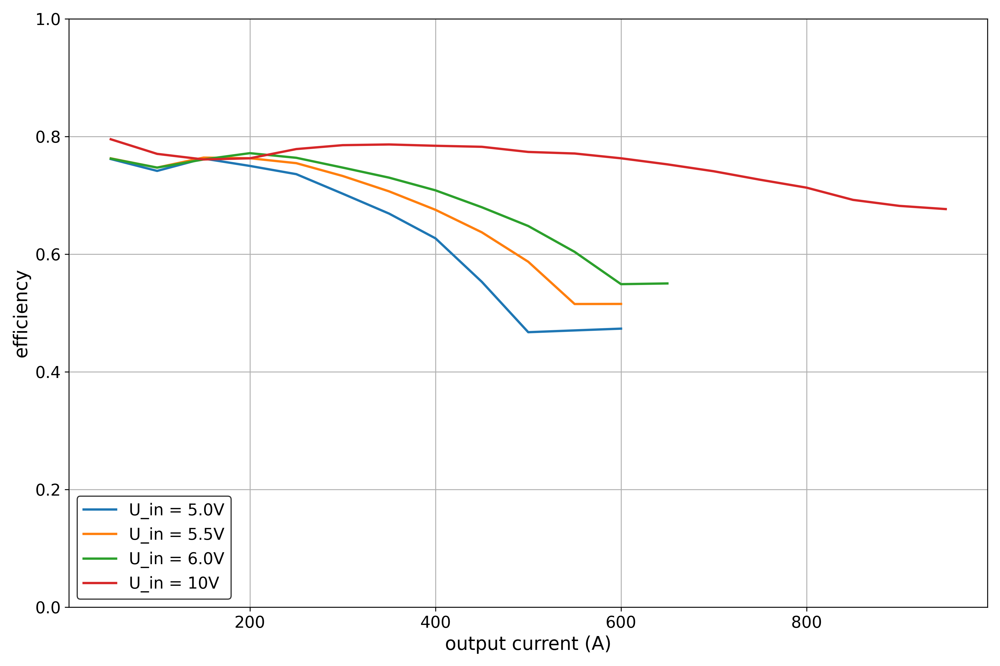

# Buck Test PCB

To get an understanding of different buck ICs and their drawbacks and benefits I designed this PCB. While all of them worked, some performed better than others. To verify my first impressions while initial testing I benchmarked the ICs over different voltages and currents.

_(the four different buck circuits that I tested)_

## ICs I tested

- XL1509-ADJE1 [[datasheet]](https://components.ubitap.com/datasheet/XL1509.pdf)
  - input voltage range: `4.5..40V`
  - output voltage: `1.23..37V` (fixed versions available too)
  - output current: `2A`
  - switching frequency: `50kHz/150kHz`
- MT2492 [[datasheet]](https://datasheet.lcsc.com/lcsc/1810262207_XI-AN-Aerosemi-Tech-MT2492_C89358.pdf)
  - input voltage range: `4.5..16V`
  - output voltage: `0.8..15V`
  - output current: `2A`
  - switching frequency: `600kHz`
- TPS62160DSG [[datasheet]](https://www.ti.com/lit/ds/symlink/tps62162.pdf?ts=1676897881217)
  - input voltage range: `3..17V`
  - output voltage: `0.9..6V` (fixed versions available too)
  - output current: `1A`
  - switching frequency: `2.25MHz`
  - can be used to create negative voltage

## Testing Results

### XL1509-ADJE1

_(output voltage vs different output currents)_

_(efficiency vs different output currents)_

While this IC is very cheap and has a wide range of input voltages, everything else about it isn't worth it. The low switching frequency is the reason for the huge passive components that have to be added around this IC. This negates the benefit of its price since the required components are rather expensive.

Moreover this IC really struggled with thermals. I had to stop the tests at `1750mA` due to the output becoming instable because the IC overheated.

### MT2492

_(output voltage vs different output currents)_

_(efficiency vs different output currents)_

The MT2492 is a cheap and less capable copy of the [MP2492](https://www.monolithicpower.com/en/mp2492.html) by MPS. It comes in a small package that combined with the smaller passive components needs very little space on the PCB.

Its efficiency is rather good and the output voltage is stable. Even over the time of multiple minutes the IC did not overheat when `2A` were pulled.

All in all this is a good IC when more than `1A` of continuous current is needed.

### TPS62160DSG

_(output voltage vs different output currents)_

_(efficiency vs different output currents)_

This IC made by TI is the smalles of them all. Paired with its high switching frequency the overall footprint of the circuit is really small. The output voltage is very stable, even for small drops and rather high currents. The efficiency is very good as well.

This is the best of the bunch, even though it is a bit more expensive. The most impressive thing is that it did not overheat, even though my thermal design for this circuit was very bad.

### TPS62160DSG (Inverted)

_(output voltage vs different output currents)_

_(efficiency vs different output currents)_
